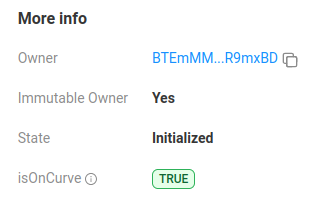

# Solana Token Extensions (Immutable Owner)

## Install & launch...

### Install

If not previously done...

**1. Clone the repo:**

```bash
git clone https://github.com/Laugharne/solana_token_extensions
```
**2. Install bun if needed**

`curl -fsSL https://bun.sh/install | bash`

`bun --help`


**3. Install dependencies:**

```bash
bun install
```
**4. Configuration:**

In `config.ts`, choose your cluster

```typescript
export const cluster = "localhost"; // localhost | devnet
```

### Launch

All the operation can been made on a **local node validator** instead of devnet, because of aidrop problems...

By running `solana-test-validator` !

> ⚠️ Beware it creates local files and directories at the current working directory.

If you choose to use it in **local**, you have to launch in another terminal the node validator:

```bash
solana-test-validator --reset
```

> ⚠️ You will need a **payer wallet**, so you can create one (`devnet` & `localhost`) by using this script.

```bash
bun run create_payer.ts
```

```bash
Create Payer wallet
===================

🏧 Airdrop       : 2 SOL to 9kvbQWEtgb7PDF14ueWru74WUjVNGACGerAsRpoiPbzY
✅ Payer         : https://explorer.solana.com/address/9kvbQWEtgb7PDF14ueWru74WUjVNGACGerAsRpoiPbzY?cluster=devnet
```
Or reuse a wallet file in `./keypair` directory !


**To run:**

```bash
bun run tkx_immutable_owner.ts
```

This project was created using `bun init` in bun v1.1.20. [Bun](https://bun.sh) is a fast all-in-one JavaScript runtime.

```bash
Solana Token Extensions (Imùmutable Owner)
==========================================


Get keys...
-----------

💰 Payer         : 9kvbQWEtgb7PDF14ueWru74WUjVNGACGerAsRpoiPbzY
💰 Mint auth.    : HLzCpTfki4xbinVgDFM5MuwSmsiYC1eugCe4BQvALxeh
💰 Owner         : BTEmMMyHLgGcRA4cnNuaA4eRTiPudb6cfbs8gER9mxBD
💰 Account       : 4QWmoqbs1xMy7oqtz1LsGbGjkhyJYsY3bnLgcRMPK8Su
ℹ️ Decimals:     : 0

ℹ️ Fetch the minimum balance needed to exempt an account for rent

Create account
--------------


Immutable Owner Init.
---------------------


Proceed to transactions
-----------------------

🚀 Signature     : https://explorer.solana.com/tx/33kNh47Qehy4LEcH2LJhurgS9paZFZe4fset82YMmauf1Ek7Xx3r1fXQmVdFBqUhG89j8DNHN8cVFQHjef8jQYTk?cluster=devnet
```
[Transaction | 33kNh47Qehy4LEcH2LJhurgS9paZFZe4fset82YMmauf1Ek7Xx3r1fXQmVdFBqUhG89j8DNHN8cVFQHjef8jQYTk](https://explorer.solana.com/tx/33kNh47Qehy4LEcH2LJhurgS9paZFZe4fset82YMmauf1Ek7Xx3r1fXQmVdFBqUhG89j8DNHN8cVFQHjef8jQYTk?cluster=devnet)

[Transaction 33kNh47Qehy4LEcH2LJhurgS9paZFZe4fset82YMmauf1Ek7Xx3r1fXQmVdFBqUhG89j8DNHN8cVFQHjef8jQYTk | Solscan](https://solscan.io/tx/33kNh47Qehy4LEcH2LJhurgS9paZFZe4fset82YMmauf1Ek7Xx3r1fXQmVdFBqUhG89j8DNHN8cVFQHjef8jQYTk?cluster=devnet)

[Account 4QWmoqbs1xMy7oqtz1LsGbGjkhyJYsY3bnLgcRMPK8Su | Solscan](https://solscan.io/account/4QWmoqbs1xMy7oqtz1LsGbGjkhyJYsY3bnLgcRMPK8Su?cluster=devnet)




## Immutable Owner with Token Extensions on Solana

Imagine you have a treasure box, and on this box, there’s a label with your **name written on it**. Now, this box is **very special**: once your name is written on it, **no one** can ever change it, not even you!

In Solana, the concept of an **"_immutable owner_"** works the same way. It means that when a token has an **immutable owner**, the owner **can never be changed**. Once someone becomes the owner, it’s **set in stone**, and no one can modify that.

### Summary:
An "_immutable owner_" means that **you are the owner** of a token and **that will never change**. No one can ever take the token from you or give it to someone else, not even you! It’s **locked forever**.


## Code

### 1. **Mint Creation**

**`createMint`**: This function initializes a new token mint.

```typescript
const decimals = 0;

const mint = await createMint(
	connection,                      // Solana connection object
	kpPayer,                         // Payer account that funds the transaction
	kpMintAuthority.publicKey,       // Mint authority (who can mint tokens)
	kpMintAuthority.publicKey,       // Freeze authority (who can freeze accounts, set to same as mint authority here)
	decimals,                        // Number of decimal places (0 means no fractional tokens, like whole units)
	undefined,                       // Optional argument for multisig mint authority (not used here)
	undefined,                       // Optional argument for multisig freeze authority (not used here)
	TOKEN_2022_PROGRAM_ID            // Token 2022 program ID to allow extensions
);
```
- **`decimals`**: By setting `decimals = 0`, the token is non-divisible, meaning the smallest unit of the token is a whole number (like 1, 2, 3 tokens). This is often used for tokens representing items like NFTs or tickets.
- **`kpMintAuthority.publicKey`**: The account that has the authority to mint new tokens. Here, the mint and freeze authority are set to the same account (`kpMintAuthority`), meaning this account can both mint and freeze tokens.
- **`TOKEN_2022_PROGRAM_ID`**: This program ID ensures that the token mint is compatible with token extensions like **Immutable Owner**.


### 2. **Create Token Account**

- **`getAccountLen([ExtensionType.ImmutableOwner])`**: This function calculates the size of the token account, considering any extensions being applied. In this case, the account size is calculated with the **Immutable Owner** extension, which requires additional data.
- **`getMinimumBalanceForRentExemption`**: This method calculates the minimum lamports needed to keep the account rent-exempt. Without enough lamports, the account would be deleted when the balance runs out.

```typescript
const accountLen = getAccountLen([ExtensionType.ImmutableOwner]); // Calculate account size based on extensions
const lamports   = await connection.getMinimumBalanceForRentExemption(accountLen); // Calculate rent-exempt balance
```

- **`SystemProgram.createAccount`**: This instruction creates a new token account, specifying the payer, the new account's public key, the required size, lamports, and the token program to manage it.

```typescript
const ixCreateAccount = SystemProgram.createAccount({
	fromPubkey      : kpPayer.publicKey,   // The account funding the creation of the new token account
	newAccountPubkey: kpAccount.publicKey, // The public key of the new token account
	space           : accountLen,          // The space required for this account (calculated above)
	lamports        : lamports,            // Lamports needed for rent-exemption
	programId       : TOKEN_2022_PROGRAM_ID // This account will use the SPL Token 2022 program
});
```


### 3. **Initialize Immutable Owner Extension**

**`createInitializeImmutableOwnerInstruction`**: This instruction makes the ownership of the token account **immutable**. After this instruction is executed, the owner of the token account can no longer be changed. This is useful in scenarios where you need to guarantee that the account owner will always remain the same.

```typescript
const ixInitializeImmutableOwner = createInitializeImmutableOwnerInstruction(
	kpAccount.publicKey,         // Token account to be initialized with immutable owner extension
	TOKEN_2022_PROGRAM_ID        // Token 2022 program ID, required for the extension
);
```

**Immutable Owner**: Once set, the owner of the token account cannot transfer ownership to anyone else, ensuring a fixed and permanent ownership of the account.


### 4. **Initialize the Token Account**

**`createInitializeAccountInstruction`**: This instruction initializes the token account to hold tokens from the specified mint.

```typescript
const ixInitializeAccount = createInitializeAccountInstruction(
	kpAccount.publicKey,         // The new token account to be initialized
	mint,                        // The mint that this account will hold tokens of
	kpOwner.publicKey,           // The owner of the account (who holds the tokens)
	TOKEN_2022_PROGRAM_ID        // Token 2022 program ID
);
```
- **`kpAccount.publicKey`**: The token account being initialized. This account will be able to hold tokens from the mint specified.
- **`mint`**: The mint associated with the tokens that this account will hold.
- **`kpOwner.publicKey`**: The public key of the owner of the token account. This account will hold and manage the tokens minted by the **mint**.
- **`TOKEN_2022_PROGRAM_ID`**: The SPL Token 2022 program manages this account and enables token extensions, such as **Immutable Owner**.


### 5. **Build and Submit the Transaction**

- **`new Transaction().add()`**: This constructs a transaction by adding the instructions in order:
  1. Create the new token account.
  2. Initialize the token account with the **Immutable Owner** extension.
  3. Initialize the token account to hold tokens from the specified mint.

```typescript
const tx = new Transaction().add(
	ixCreateAccount,               // Add the instruction to create the account
	ixInitializeImmutableOwner,    // Add the instruction to make the account's owner immutable
	ixInitializeAccount            // Add the instruction to initialize the token account
);
```

**`sendAndConfirmTransaction`**: This sends the transaction to the Solana network and waits for confirmation.

```typescript
const sigTx = await sendAndConfirmTransaction(
	connection,                     // Solana connection object
	tx,                             // The transaction containing all the instructions
	[kpPayer, kpAccount],           // Signers (the payer and the new token account)
	undefined                       // Optional commitment level (can be left as default)
);
```
- **Signers**: The transaction needs to be signed by the payer (`kpPayer`), who is paying for the transaction, and the newly created account (`kpAccount`), which is being initialized.


### Summary
- The code creates a **new token mint** with **0 decimals**, meaning the tokens are non-divisible and represent whole units.
- It also creates a new **token account** for the specified mint, with the additional extension of making the account's owner **immutable**.
- Once the transaction is processed, the token account will hold tokens from the mint, and its ownership will be permanently fixed, ensuring no further transfers of ownership.


## Source

[Immutable Owner with Token Extensions on Solana - YouTube](https://www.youtube.com/watch?v=PyLEJa8anaU)