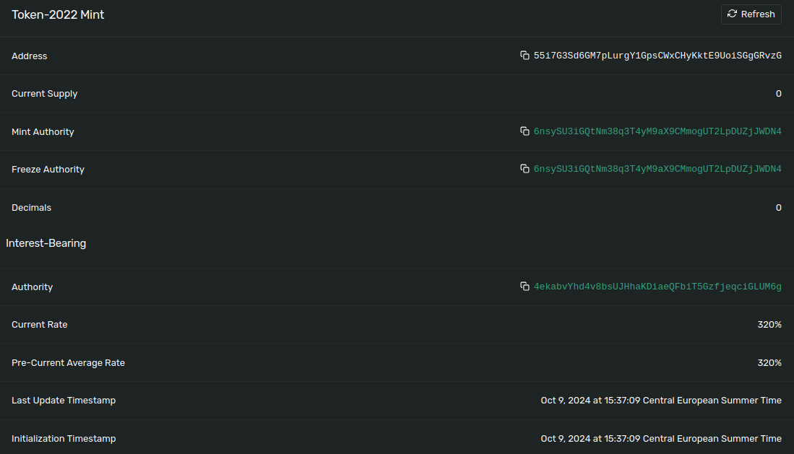
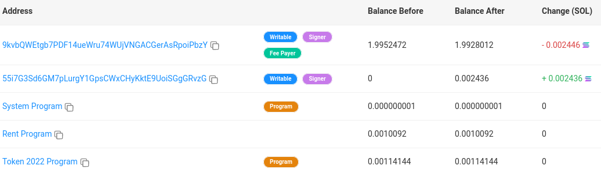

# Solana Token Extensions (Interest Bearing)

## Install & launch...

### Install

If not previously done...

**1. Clone the repo:**

```bash
git clone https://github.com/Laugharne/solana_token_extensions
```
**2. Install bun if needed**

`curl -fsSL https://bun.sh/install | bash`

`bun --help`


**3. Install dependencies:**

```bash
bun install
```
**4. Configuration:**

In `config.ts`, choose your cluster

```typescript
export const cluster = "localhost"; // localhost | devnet
```

### Launch

All the operation can been made on a **local node validator** instead of devnet, because of aidrop problems...

By running `solana-test-validator` !

> ⚠️ Beware it creates local files and directories at the current working directory.

If you choose to use it in **local**, you have to launch in another terminal the node validator:

```bash
solana-test-validator --reset
```

> ⚠️ You will need a **payer wallet**, so you can create one (`devnet` & `localhost`) by using this script.

```bash
bun run create_payer.ts
```

```bash
Create Payer wallet
===================

🏧 Airdrop       : 2 SOL to 9kvbQWEtgb7PDF14ueWru74WUjVNGACGerAsRpoiPbzY
✅ Payer         : https://explorer.solana.com/address/9kvbQWEtgb7PDF14ueWru74WUjVNGACGerAsRpoiPbzY?cluster=devnet
```
Or reuse a wallet file in `./keypair` directory !


**To run:**

```bash
bun run tkx_interest_bearing.ts
```

This project was created using `bun init` in bun v1.1.20. [Bun](https://bun.sh) is a fast all-in-one JavaScript runtime.

```bash
Solana Token Extensions (Interest Bearing)
==========================================

ℹ️ Get keys...
💰 Payer         : 9kvbQWEtgb7PDF14ueWru74WUjVNGACGerAsRpoiPbzY
💰 Mint auth.    : 6nsySU3iGQtNm38q3T4yM9aX9CMmogUT2LpDUZjJWDN4
💰 Rate auth.    : 4ekabvYhd4v8bsUJHhaKDiaeQFbiT5GzfjeqciGLUM6g
💰 Mint          : 55i7G3Sd6GM7pLurgY1GpsCWxCHyKktE9UoiSGgGRvzG

ℹ️ Rate: 32000%
ℹ️ Decimals: 0
ℹ️ Mint: 55i7G3Sd6GM7pLurgY1GpsCWxCHyKktE9UoiSGgGRvzG
ℹ️ Balance: 1000

- 1000
- 1000.0001014046625
- 1000.0002028093351
- 1000.0004056187115
- 1000.000507023415
- 1000.000507023415
- 1000.0007098328532
- 1000.0008112375875
- 1000.0008112375875
- 1000.0010140470872

...
```

[Address | 4bDywTY6AyRj2ZkbtuzbyRi9jqyQiVbGaTKAuM3QLiYp2JYBMeW24Pv8rLAFwKuY9mGrFcj9zB51612LJJJdjqKC](https://explorer.solana.com/address/55i7G3Sd6GM7pLurgY1GpsCWxCHyKktE9UoiSGgGRvzG?cluster=devnet)

**Address:**



**Transaction:**
[Transaction](https://solscan.io/tx/5QdapyuKxC2JP1AL8NVH9wCfV3uRNfsMWatKLDX2Q7Zc9cN1ZJaUqhJVLuNCfQztDrnpvwr1oiDXzcctgNdu1XUn?cluster=devnet#solBalanceChange)



**Instruction Data:**

```json
{
  "info": {
    "mint":          "55i7G3Sd6GM7pLurgY1GpsCWxCHyKktE9UoiSGgGRvzG",
    "rate":          32000,
    "rateAuthority": "4ekabvYhd4v8bsUJHhaKDiaeQFbiT5GzfjeqciGLUM6g"
  },
  "type": "initializeInterestBearingConfig"
}
```

## Interest Bearing with Token Extensions on Solana

Imagine you have a piggy bank where you keep your coins. Now, imagine that this piggy bank is **magical**! The longer you leave it without touching the money, the more it **adds** coins by itself!

That means if you have 10 coins today and leave them in your magical piggy bank, tomorrow you might have 11 coins, without doing anything!

In Solana, **"interest bearing tokens"** work a bit like this magical piggy bank. When you keep tokens in an account for a certain amount of time, these tokens **"_bear interest_"**, which means they **grow** on their own, just like extra coins appearing in your piggy bank over time.

### Summary:
With "_interest bearing tokens_", the longer you keep your tokens in an account, the more **new tokens** you earn over time, like a piggy bank giving you bonus coins just for waiting! Cool, right? 😊


## Code explaination

### 1. Creating an Interest-Bearing Mint with `createInterestBearingMint`

This code creates an **interest-bearing mint**. A mint is essentially a smart contract that can create new tokens. In this case, the mint produces tokens that can **earn interest over time** based on a specific rate controlled by the `kpRateAuthority`. The `decimals` parameter specifies how many decimal places the token can have, which is important for defining its smallest unit.

```typescript
const mint = await createInterestBearingMint(
    connection,                // The Solana connection object to interact with the blockchain
    kpPayer,                   // Public key of the paying account (pays for rent and fees)
    kpMintAuthority.publicKey, // Public key of the mint authority (controls the minting of tokens)
    kpMintAuthority.publicKey, // Public key of the freeze authority
                               // (can optionally freeze accounts, here set to the same as mint authority)
    kpRateAuthority.publicKey, // Public key of the rate authority (controls the interest rate of the tokens)
    rate,                      // The interest rate that the tokens will earn over time
    decimals,                  // Number of decimal places for the tokens
    kpMint,                    // Public key of the mint account that will be created
    undefined,                 // Optional parameter for the freeze authority (left undefined here)
    TOKEN_2022_PROGRAM_ID      // The program ID for the Token 2022 program
);
```

### 2. Periodically Displaying the Token Balance in User-Friendly Format

This block of code uses `setInterval` to **check the account balance** and **display it every second** in a more user-friendly format.

- `amountToUiAmount` is a function that converts the raw token balance (_which might have a lot of decimal places_) into a human-readable format, considering the decimal places specified when the mint was created.
- Every second, it logs the **updated balance** (`uiAmount`), reflecting the interest being earned on the tokens over time.

```typescript
setInterval(async () => {
    const uiAmount = await amountToUiAmount(
        connection,           // The Solana connection object
        kpPayer,              // Public key of the paying account (the account holding the tokens)
        mint,                 // The interest-bearing mint created earlier
        accountBalance,       // The balance of tokens in the account (in raw token units)
        TOKEN_2022_PROGRAM_ID // The program ID for the Token 2022 program
    );
    console.log("- " + uiAmount);
}, 1000);
```

This setup is great for **monitoring how tokens are growing** in value thanks to the interest-earning functionality!


### Summary

- The first part of the code creates an **interest-bearing mint**, which produces tokens that accrue interest over time.
- The second part periodically fetches the token balance and displays it in a user-friendly format, taking into account the ongoing interest accrual.


## Source

[Interest Bearing Tokens with Token Extensions on Solana - YouTube](https://www.youtube.com/watch?v=YFTUGviKg7A)