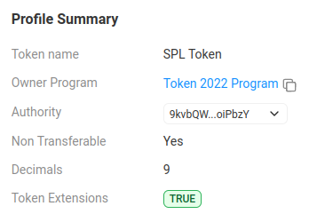

# Solana Token Extensions (Non-Transferable Tokens)

## Install & launch...

### Install

If not previously done...

**1. Clone the repo:**

```bash
git clone https://github.com/Laugharne/solana_token_extensions
```
**2. Install bun if needed**

`curl -fsSL https://bun.sh/install | bash`

`bun --help`


**3. Install dependencies:**

```bash
bun install
```
**4. Configuration:**

In `config.ts`, choose your cluster

```typescript
export const cluster = "localhost"; // localhost | devnet
```

### Launch

All the operation can been made on a **local node validator** instead of devnet, because of aidrop problems...

By running `solana-test-validator` !

> ⚠️ Beware it creates local files and directories at the current working directory.

If you choose to use it in **local**, you have to launch in another terminal the node validator:

```bash
solana-test-validator --reset
```

> ⚠️ You will need a **payer wallet**, so you can create one (`devnet` & `localhost`) by using this script.

```bash
bun run create_payer.ts
```

```bash
Create Payer wallet
===================

🏧 Airdrop       : 2 SOL to 9kvbQWEtgb7PDF14ueWru74WUjVNGACGerAsRpoiPbzY
✅ Payer         : https://explorer.solana.com/address/9kvbQWEtgb7PDF14ueWru74WUjVNGACGerAsRpoiPbzY?cluster=devnet
```
Or reuse a wallet file in `./keypair` directory !


**To run:**

```bash
bun run tkx_non_transferable_tokens.ts
```

This project was created using `bun init` in bun v1.1.20. [Bun](https://bun.sh) is a fast all-in-one JavaScript runtime.


```bash
Solana Token Extensions (Non-Transferable Tokens)
=================================================

Get keys...
-----------

💰 Payer         : 9kvbQWEtgb7PDF14ueWru74WUjVNGACGerAsRpoiPbzY
💰 Mint          : CFsq3FQKb23ZfMh6kKrzMnYYAwUU3hCrbDqfcq7WFEHn

ℹ️ Fetch the minimum balance needed to exempt an account of rent

Create account
--------------

Non-Transferable Token Init.
----------------------------

Initialize mint
---------------

ℹ️ Decimals      : 9

Proceed to transactions
-----------------------

🚀 Signature     : https://explorer.solana.com/tx/4CTQQuCt4Kz11EqV8inFdaTBd2zJDCFLKjkhNhSaB8A8xsKxFfNVTkVky6PjrJVPDG5X5PWTyGbV8oE1eAyXKiHw?cluster=devnet
```

- [Transaction 4CTQQuCt4Kz11EqV8inFdaTBd2zJDCFLKjkhNhSaB8A8xsKxFfNVTkVky6PjrJVPDG5X5PWTyGbV8oE1eAyXKiHw | Solscan](https://solscan.io/tx/4CTQQuCt4Kz11EqV8inFdaTBd2zJDCFLKjkhNhSaB8A8xsKxFfNVTkVky6PjrJVPDG5X5PWTyGbV8oE1eAyXKiHw?cluster=devnet)
- [Token CFsq3FQKb23ZfMh6kKrzMnYYAwUU3hCrbDqfcq7WFEHn | Solscan](https://solscan.io/token/CFsq3FQKb23ZfMh6kKrzMnYYAwUU3hCrbDqfcq7WFEHn?cluster=devnet)




**Instruction Data:**

```json
{
  "info": {
    "mint": "CFsq3FQKb23ZfMh6kKrzMnYYAwUU3hCrbDqfcq7WFEHn"
  },
  "type": "initializeNonTransferableMint"
}
```

## Non-Transferable Tokens with Token Extensions on Solana

Alright, imagine you have an awesome toy, but this toy has a special rule: **you can play with it**, but you **cannot give it** to someone else. It’s yours forever, and even if you wanted to lend or give it away, **you’re not allowed** to do so.

In Solana, **"_non-transferable tokens_"** are a bit like this special toy. These tokens are **locked** with their owner, which means once you have them, **you cannot transfer** or send them to someone else. They’re yours for life!

### Summary:
A "_non-transferable token_" is like a toy that’s **yours forever**, and **you can’t give it away** to anyone, even if you wanted to. It’s just **non-tradable**!


## Code explaination

### 1. **Calculate the Mint Length and Rent-Exempt Lamports**

```typescript
const mintLen  = getMintLen([ExtensionType.NonTransferable]); // Calculate mint account size based on extensions
const lamports = await connection.getMinimumBalanceForRentExemption(mintLen); // Get the minimum balance needed for rent-exemption
```
- **`getMintLen`**: This function calculates the required space (`mintLen`) in the mint account by considering the extensions, in this case, the **Non-Transferable** extension. Extensions like this add extra data to the mint, which increases the required size of the account.
- **`getMinimumBalanceForRentExemption`**: This function calculates the minimum number of lamports (Solana's native token) that the account needs to be rent-exempt. In Solana, accounts need a certain amount of funds to avoid being deleted due to insufficient balance.


### 2. **Create a New Mint Account**

**`SystemProgram.createAccount`**: This instruction creates a new account on Solana. The account is associated with the **SPL Token 2022 program** (`TOKEN_2022_PROGRAM_ID`), which is necessary to support features like token extensions (such as non-transferable tokens).

```typescript
const ixCreateAccount = SystemProgram.createAccount({
	fromPubkey      : pkPayer.publicKey,     // Account that pays for the creation of the mint
	newAccountPubkey: pkMint.publicKey,      // The new mint account's public key
	space           : mintLen,               // The size of the account (calculated above)
	lamports        : lamports,              // Amount of lamports needed for rent-exemption
	programId       : TOKEN_2022_PROGRAM_ID, // The SPL Token 2022 program ID
});
```

- **`fromPubkey`**: The account (`pkPayer`) that will fund the creation of the new mint account.
- **`newAccountPubkey`**: The public key of the new mint account (`pkMint`).
- **`space`**: The size of the mint account, determined by the presence of extensions.
- **`lamports`**: The amount needed to make the account rent-exempt, calculated previously.
- **`programId`**: Specifies that this account will be managed by the **SPL Token 2022 program**, which allows using token extensions.


### 3. **Initialize the Mint with Non-Transferable Extension**

**`createInitializeNonTransferableMintInstruction`**: This instruction initializes the mint account as **non-transferable**. Non-transferable tokens cannot be sent or transferred to other accounts once minted, making them useful for cases like governance or reward tokens.

```typescript
const ixInitializeNonTransferableMint = createInitializeNonTransferableMintInstruction(
	pkMint.publicKey,     // The mint account being initialized
	TOKEN_2022_PROGRAM_ID // Token 2022 program ID
);
```
- **`pkMint.publicKey`**: The mint account that is being initialized with this property.
- **`TOKEN_2022_PROGRAM_ID`**: This is required since the non-transferable extension is only available in the SPL Token 2022 program.


### 4. **Initialize the Mint’s Standard Settings**

**`createInitializeMintInstruction`**: Initializes the mint with standard configurations like decimal places and authorities, **`decimals`** set how divisible the token is. Here, `9` decimals means 1 token = 1,000,000,000 (1 billion smallest units).

```typescript
const decimals = 9; // Set token decimals (e.g., 1 token = 1 billion smallest units)

const ixInitializeMint = createInitializeMintInstruction(
	pkMint.publicKey,      // The mint account being initialized
	decimals,              // Number of decimal places (for fractional tokens)
	pkPayer.publicKey,     // The mint authority (who can mint new tokens)
	null,                  // Freeze authority is set to null (optional)
	TOKEN_2022_PROGRAM_ID  // Token 2022 program ID
);
```
- **`pkMint.publicKey`**: The mint account being initialized.
- **`pkPayer.publicKey`**: The authority that will have permission to mint new tokens.
- **`null`**: The freeze authority is not set here, meaning no account will be able to freeze token accounts for this mint.
- **`TOKEN_2022_PROGRAM_ID`**: The Token 2022 program is required because we are using extensions, such as non-transferable tokens.


### 5. **Building the Transaction and Sending It**

**`new Transaction().add()`**: A transaction object is created and the three instructions (`ixCreateAccount`, `ixInitializeNonTransferableMint`, and `ixInitializeMint`) are added sequentially.

```typescript
const tx = new Transaction().add(
	ixCreateAccount,                 // Add account creation instruction
	ixInitializeNonTransferableMint, // Add non-transferable mint initialization
	ixInitializeMint                 // Add standard mint initialization
);
```

**`sendAndConfirmTransaction`**: Sends the transaction to the Solana blockchain and waits for confirmation.

```typescript
const sigTx = await sendAndConfirmTransaction(
	connection,       // Solana connection object
	tx,               // The transaction we built
	[pkPayer, pkMint] // Signers (payer and the mint account)
);
```

**`[pkPayer, pkMint]`**: These are the signers required for the transaction. The payer (`pkPayer`) funds the transaction, while the mint account (`pkMint`) needs to be signed because it is being initialized.


### Summary

- The code creates a **new mint account** on Solana using the **SPL Token 2022 program**.
- It initializes the mint as **non-transferable**, meaning the tokens minted cannot be transferred.
- The mint account is also initialized with a specific number of **decimal places** and authorities for minting, but no freeze authority.
- Finally, the transaction is sent to the Solana network and signed by the necessary accounts.

## Sources

- [Non-Transferable (Soul-bound) Tokens with Token Extensions on Solana - YouTube](https://www.youtube.com/watch?v=mtdjdnwzPi4)
- [Non-Transferable Token | Solana](https://solana.com/developers/courses/token-extensions/non-transferable-token)