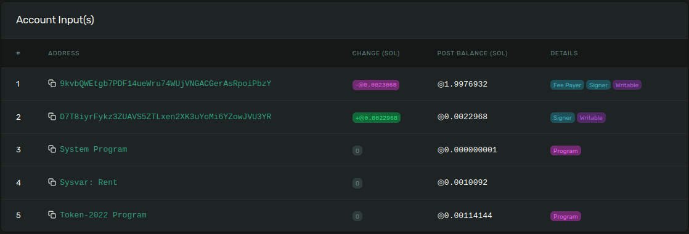
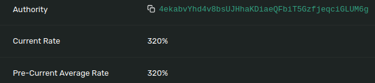

# Solana Token Extensions (Permanent Delegate)

## Install & launch...

### Install

If not previously done...

**1. Clone the repo:**

```bash
git clone https://github.com/Laugharne/solana_token_extensions
```
**2. Install bun if needed**

`curl -fsSL https://bun.sh/install | bash`

`bun --help`


**3. Install dependencies:**

```bash
bun install
```
**4. Configuration:**

In `config.ts`, choose your cluster

```typescript
export const cluster = "localhost"; // localhost | devnet
```

### Launch

All the operation can been made on a **local node validator** instead of devnet, because of aidrop problems...

By running `solana-test-validator` !

> ⚠️ Beware it creates local files and directories at the current working directory.

If you choose to use it in **local**, you have to launch in another terminal the node validator:

```bash
solana-test-validator --reset
```

> ⚠️ You will need a **payer wallet**, so you can create one (`devnet` & `localhost`) by using this script.

```bash
bun run create_payer.ts
```

```bash
Create Payer wallet
===================

🏧 Airdrop       : 2 SOL to 9kvbQWEtgb7PDF14ueWru74WUjVNGACGerAsRpoiPbzY
✅ Payer         : https://explorer.solana.com/address/9kvbQWEtgb7PDF14ueWru74WUjVNGACGerAsRpoiPbzY?cluster=devnet
```
Or reuse a wallet file in `./keypair` directory !


**To run:**

```bash
bun run permanent_delegate.ts
```

```bash
Solana Token Extensions (Permanent Delegate)
============================================

💰 Payer         : 9kvbQWEtgb7PDF14ueWru74WUjVNGACGerAsRpoiPbzY
💰 Mint auth.    : D7T8iyrFykz3ZUAVS5ZTLxen2XK3uYoMi6YZowJVU3YR
💰 Delegate      : JhqsHhqBRpAMhVcPtyAKy8feapyTriw85FrtRi7SZhR

Fetch the minimum balance needed to exempt an account of rent
-------------------------------------------------------------

Create account
--------------

Permanent delegate
------------------

Initialize mint
---------------

Procedd to transactions
-----------------------

🚀 Signature     : https://explorer.solana.com/tx/4bDywTY6AyRj2ZkbtuzbyRi9jqyQiVbGaTKAuM3QLiYp2JYBMeW24Pv8rLAFwKuY9mGrFcj9zB51612LJJJdjqKC?cluster=devnet
```

[Transaction | 4bDywTY6AyRj2ZkbtuzbyRi9jqyQiVbGaTKAuM3QLiYp2JYBMeW24Pv8rLAFwKuY9mGrFcj9zB51612LJJJdjqKC](https://explorer.solana.com/tx/4bDywTY6AyRj2ZkbtuzbyRi9jqyQiVbGaTKAuM3QLiYp2JYBMeW24Pv8rLAFwKuY9mGrFcj9zB51612LJJJdjqKC?cluster=devnet)

**Accounts:**






**Instruction Data:**

```json
{
  "info": {
    "delegate": "JhqsHhqBRpAMhVcPtyAKy8feapyTriw85FrtRi7SZhR",
    "mint":     "D7T8iyrFykz3ZUAVS5ZTLxen2XK3uYoMi6YZowJVU3YR"
  },
  "type": "initializePermanentDelegate"
}
```

This project was created using `bun init` in bun v1.1.20. [Bun](https://bun.sh) is a fast all-in-one JavaScript runtime.


## Permanent Delegate with Token Extensions on Solana

Imagine you have a special box, and this box contains toys (let's say the toys are **tokens**). Normally, **only you** have the key to open the box and give or take the toys. But sometimes, you might be too busy, or you want someone else to be able to use the box for you.

That's where something special called a **"_permanent delegate_"** comes in. It's like you're giving a **copy of your key** to someone else so they can **always** open your box and do certain things with your toys, **even when you're not around** to do it yourself. For example, this person could:
- Take some toys (tokens),
- Give toys to others,
- Maybe even add new toys to the box.

The word "_permanent_" means that you're giving them this key **forever** or until you decide to take it back.

But be careful! Even though this person has a key, they can't do everything. You can decide in advance **exactly** what they are allowed to do. Maybe they can only take toys, but not add any. It's up to you.

### Summary
The "_permanent delegate_" in Solana is like lending a special key to someone else so they can manage your tokens (toys) on your behalf for a long time, but **only** according to the rules you've set.


## Code explaination

### 1. Creating an Account with `SystemProgram.createAccount`

This code creates a new account on Solana. The payer (`kpPayer`) pays the rent for this new account, which will be managed by the **Token 2022** program.

```typescript
const ixCreateAccount = SystemProgram.createAccount({
	fromPubkey      : kpPayer.publicKey,         // Public key of the paying account
	newAccountPubkey: kpMintAuthority.publicKey, // Public key of the newly created account for the mint authority
	space           : mintLen,                   // Space reserved for this account (in bytes)
	lamports        : lamports,                  // Number of lamports (Solana) sent to cover the rent for the account
	programId       : TOKEN_2022_PROGRAM_ID,     // Program ID that will manage this account (in this case, the Token 2022 program)
});
```


### 2. Initializing a "Permanent Delegate" with `createInitializePermanentDelegateInstruction`

This instruction initializes a **permanent delegate**. The delegate (`kpPermanentDelegate`) is given the authority to manage certain actions on the token account, as defined by the program, even permanently.

```typescript
const ixInitializePermanentDelegate = createInitializePermanentDelegateInstruction(
	kpMintAuthority.publicKey,     // Public key of the mint authority
	kpPermanentDelegate.publicKey, // Public key of the permanent delegate
	TOKEN_2022_PROGRAM_ID          // The program ID for the Token 2022 program
);
```


### 3. Initializing the Mint with `createInitializeMintInstruction`

This instruction initializes a **mint** for the token, specifying the number of decimals for the token’s value and assigning the mint authority (`kpMintAuthority`).

```typescript
const ixInitializeMint = createInitializeMintInstruction(
	kpMintAuthority.publicKey, // Public key of the mint authority
	decimals,                  // Number of decimal places for the tokens
	kpMintAuthority.publicKey, // Public key of the mint authority
	null,                      // Optional freeze authority, set to null in this case
	TOKEN_2022_PROGRAM_ID      // Program ID for the Token 2022 program
);
```


### 4. Creating a Transaction and Sending It

This part creates a **transaction** that adds the instructions to create an account, initialize a permanent delegate, and initialize the mint. It then sends and confirms the transaction, signed by both the payer and mint authority.

```typescript
const tx = new Transaction().add(
	ixCreateAccount,               // Instruction to create the account
	ixInitializePermanentDelegate, // Instruction to initialize the permanent delegate
	ixInitializeMint               // Instruction to initialize the mint
);

const sigTx = await sendAndConfirmTransaction(
	connection,                 // The Solana connection object
	tx,                         // The transaction object
	[kpPayer, kpMintAuthority], // Signers for the transaction
	undefined                   // Optional settings, left undefined here
);
```

## Results

```bash
❯ bun run tkx_permanent_delegate.ts

Solana Token Extensions (Permanent Delegate)
============================================

💰 Payer         : DKSDNSKfKp92977SBGKKYLnmSprR88jTtx5Jmwi8dFin
💰 Mint auth.    : H5jLMr2BW67sSjcceo9jhopAjDVPduxuyx7L27r1fyaU
💰 Delegate      : 8C2gy1dkEW6AdLa13yh7NbtC9wiJayqTdtjSCY9L4j7i

Fetch the minimum balance needed to exempt an account of rent
-------------------------------------------------------------

Create account
--------------

Permanent delegate
------------------

Initialize mint
---------------

Procedd to transactions
-----------------------

🚀 Signature     : https://explorer.solana.com/tx/62XJWgEr1FNtXS64ZH7amqm4FqULJB99YG2ihPANsoDRTgeo25Y2A3uf8QQY1FxmD6rTeiYSg7Vn5DjkMix31oSn?cluster=localhost
```


## Source

[Permanent Delegate with Token Extensions on Solana - YouTube](https://www.youtube.com/watch?v=pro4hlJpHG4)

