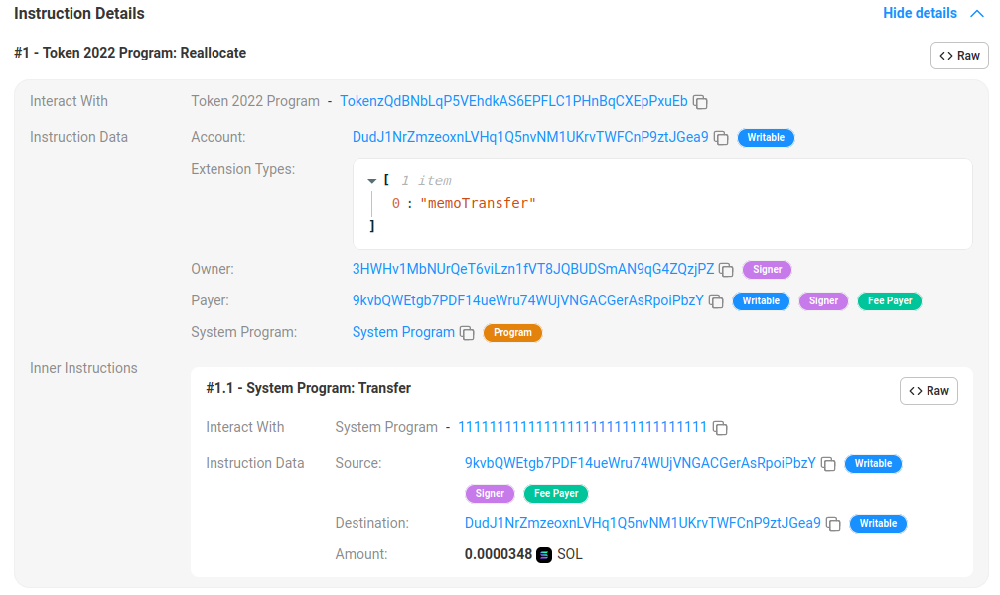

# Solana Token Extensions (Reallocate Token Account Sizes)

## Install & launch...

### Install

If not previously done...

**1. Clone the repo:**

```bash
git clone https://github.com/Laugharne/solana_token_extensions
```
**2. Install bun if needed**

`curl -fsSL https://bun.sh/install | bash`

`bun --help`


**3. Install dependencies:**

```bash
bun install
```
**4. Configuration:**

In `config.ts`, choose your cluster

```typescript
export const cluster = "localhost"; // localhost | devnet
```

### Launch

All the operation can been made on a **local node validator** instead of devnet, because of aidrop problems...

By running `solana-test-validator` !

> ⚠️ Beware it creates local files and directories at the current working directory.

If you choose to use it in **local**, you have to launch in another terminal the node validator:

```bash
solana-test-validator --reset
```

> ⚠️ You will need a **payer wallet**, so you can create one (`devnet` & `localhost`) by using this script.

```bash
bun run create_payer.ts
```

```bash
Create Payer wallet
===================

🏧 Airdrop       : 2 SOL to 9kvbQWEtgb7PDF14ueWru74WUjVNGACGerAsRpoiPbzY
✅ Payer         : https://explorer.solana.com/address/9kvbQWEtgb7PDF14ueWru74WUjVNGACGerAsRpoiPbzY?cluster=devnet
```
Or reuse a wallet file in `./keypair` directory !


**To run:**

```bash
bun run tkx_reallocate_size.ts
```


[Transaction | 33kNh47Qehy4LEcH2LJhurgS9paZFZe4fset82YMmauf1Ek7Xx3r1fXQmVdFBqUhG89j8DNHN8cVFQHjef8jQYTk](https://explorer.solana.com/tx/3wyzCqu3Vypein47LmqQXm3sQ917Kzp9kDWCED9yiXoXeDnfDrJoZnhR41mhhecjWqbD1KM9t2mKSN6wRBuihKpH?cluster=devnet)

**Instruction Data:**

```json
{
  "info": {
    "account": "DudJ1NrZmzeoxnLVHq1Q5nvNM1UKrvTWFCnP9ztJGea9",
    "owner":   "3HWHv1MbNUrQeT6viLzn1fVT8JQBUDSmAN9qG4ZQzjPZ"
  },
  "type": "enableRequiredMemoTransfers"
}
```

[Transaction 3wyzCqu3Vypein47LmqQXm3sQ917Kzp9kDWCED9yiXoXeDnfDrJoZnhR41mhhecjWqbD1KM9t2mKSN6wRBuihKpH | Solscan](https://solscan.io/tx/3wyzCqu3Vypein47LmqQXm3sQ917Kzp9kDWCED9yiXoXeDnfDrJoZnhR41mhhecjWqbD1KM9t2mKSN6wRBuihKpH?cluster=devnet)



This project was created using `bun init` in bun v1.1.20. [Bun](https://bun.sh) is a fast all-in-one JavaScript runtime.

```bash
Solana Token Extensions (Reallocate Token Account Sizes)
========================================================


Get keys...
-----------

💰 Payer         : 9kvbQWEtgb7PDF14ueWru74WUjVNGACGerAsRpoiPbzY
💰 Mint auth.    : 8inSz5FcHyK3xddELyJxcdtKD79NGNBai4WwN1XfBjF1
💰 Owner         : 3HWHv1MbNUrQeT6viLzn1fVT8JQBUDSmAN9qG4ZQzjPZ
ℹ️ Decimals      : 0


Initialize mint
---------------


Create account
--------------


Reallocation
------------


Proceed to transactions
-----------------------

🚀 Signature     : https://explorer.solana.com/tx/3wyzCqu3Vypein47LmqQXm3sQ917Kzp9kDWCED9yiXoXeDnfDrJoZnhR41mhhecjWqbD1KM9t2mKSN6wRBuihKpH?cluster=devnet
```

## Reallocate Token Account Sizes with Token Extensions on Solana

Imagine you have a **magic backpack**. At first, you can only put **10 toys** in it because that’s the size you chose. But one day, you realize you want **more toys**, so you use magic to **expand** your backpack so it can now hold **20 toys**.

In Solana, the concept of **"_reallocate token account sizes_"** works a bit like that. When you create an account to store tokens, you decide on a **size** (how many things it can hold). But sometimes, you may need **more space** in that account (for example, to manage more types of tokens or additional information). So, you can **reallocate** or expand the size of the account so it can hold **more data**.

### Summary:
"Reallocate token account sizes" means you can **expand an account** (like your magic backpack) so it can hold **more tokens or information** when needed, without having to recreate everything from scratch.

### cNFT?

The **"reallocate token account sizes"** feature is not necessary or compatible with **"_compressed tokens_"** in Solana.

**Compressed tokens** are a special way of storing tokens where the data is **"_compressed_"** to save space and costs on the blockchain. The idea is to use much less space to handle very large sets of tokens, like compressed NFTs or mass tokens. With this mechanism, the information is essentially "outsourced" to off-chain data structures, making the need to reallocate on-chain account space unnecessary.

In the case of normal SPL token accounts, you may need to increase the account size as you add information, but for **compressed tokens**, the data is stored more compactly and managed differently, so resizing accounts is not relevant here.

**Reallocate token account sizes** is used to expand a standard SPL token account to add more data. **Compressed tokens** use a different system to manage data, so they don’t need this resizing feature.


## Code explaination

### 1. **Mint Creation**

**`createMint`**: This function initializes a new token mint.

```typescript
const decimals = 0;

const mint = await createMint(
	connection,                // Solana connection object
	pkPayer,                   // Payer account that funds the transaction
	pkMintAuthority.publicKey, // Mint authority (who can mint tokens)
	pkMintAuthority.publicKey, // Freeze authority (who can freeze accounts, here it's the same as the mint authority)
	decimals,                  // Number of decimal places (0 means whole units, like NFTs or tickets)
	undefined,                 // Optional multisig mint authority (not used here)
	undefined,                 // Optional multisig freeze authority (not used here)
	TOKEN_2022_PROGRAM_ID      // Token 2022 program ID to support token extensions
);
```

  - **`decimals = 0`**: The token created will be non-divisible (e.g., you can't own 0.5 of the token). This is often the case for non-fungible tokens (NFTs) or items like tickets, where partial ownership doesn’t make sense.
  - **`pkMintAuthority.publicKey`**: The account with the authority to mint new tokens.
  - **`TOKEN_2022_PROGRAM_ID`**: Ensures the mint can leverage the newer token extensions provided by the 2022 Token program.


### 2. **Account Creation for Holding Tokens**

**`createAccount`**: This creates a new token account that can hold tokens from the specified mint.

```typescript
const account = await createAccount(
	connection,            // Solana connection object
	pkPayer,               // Payer account funding the creation of the token account
	mint,                  // The mint associated with this account (created in the previous step)
	pkOwner.publicKey,     // The owner of the new token account
	undefined,             // Optional multisig signer (not used here)
	undefined,             // Optional programId (defaults to SPL Token program)
	TOKEN_2022_PROGRAM_ID  // Token 2022 program ID to support token extensions
);
```

  - **`mint`**: The token mint that this account is associated with. This account can only hold tokens from this specific mint.
  - **`pkOwner.publicKey`**: The owner of the token account who will manage the tokens.
  - **`TOKEN_2022_PROGRAM_ID`**: Ensures this account can utilize the latest token extensions, such as the **Memo Transfer** extension described below.


### 3. **Reallocate Token Account to Support Extensions**

**`createReallocateInstruction`**: This instruction is used to **resize** the token account to add support for specific extensions.

```typescript
const extensions = [ExtensionType.MemoTransfer];  // Specify the Memo Transfer extension

const ixReallocate = createReallocateInstruction(
	account,               // Token account to reallocate
	pkPayer.publicKey,     // Payer public key for transaction fees
	extensions,            // Extensions to enable (Memo Transfer)
	pkOwner.publicKey,     // Owner of the token account
	undefined,             // Optional multisig signer (not used here)
	TOKEN_2022_PROGRAM_ID  // Token 2022 program ID for token extensions
);
```
  - **`ExtensionType.MemoTransfer`**: This extension adds a requirement for memos on token transfers. A memo is an arbitrary text note (usually less than 64 bytes) that can be attached to the transfer transaction.
  - **Reallocating the Account**: The original account is resized to accommodate the **Memo Transfer** extension. Without this reallocation, the account wouldn't have enough space to support the extension.


### 4. **Enable Required Memo Transfers**

**`createEnableRequiredMemoTransfersInstruction`**: This instruction **enables the requirement** that all future transfers from this token account must include a memo.

```typescript
const ixEnableRequiredMemoTransfer = createEnableRequiredMemoTransfersInstruction(
	account,                 // Token account where memo transfers are required
	pkOwner.publicKey,       // Owner of the account
	[],                      // Optional multisig signer array (empty in this case)
	TOKEN_2022_PROGRAM_ID    // Token 2022 program ID
);
```

  - **Memo Transfer**: This extension can be used in applications where it’s important to record additional information with each token transfer, such as transaction descriptions, references, or compliance data.
  - **Why Enable Required Memos?**: Requiring a memo can enhance accountability or transparency in certain use cases, such as payments for specific services or regulatory compliance.


### 5. **Build and Submit the Transaction**

**`new Transaction().add()`**: This constructs a transaction that includes two key instructions:
  1. **Reallocate the token account** to ensure it has enough space to support the **Memo Transfer** extension.
  2. **Enable the Memo Transfer requirement**, making memos mandatory for all future transfers from the account.

```typescript
const tx = new Transaction().add(
	ixReallocate,                // Add instruction to reallocate account size to support extensions
	ixEnableRequiredMemoTransfer // Add instruction to enforce memo transfers
);
```

**`sendAndConfirmTransaction`**: This function sends the transaction to the Solana blockchain and waits for confirmation.
  - **Signers**: The transaction needs to be signed by both the payer (`pkPayer`) and the owner of the token account (`pkOwner`).

```typescript
const sigTx = await sendAndConfirmTransaction(
	connection,             // Solana connection object
	tx,                     // The transaction containing the instructions
	[pkPayer, pkOwner]      // Signers (payer for fees, and account owner)
);
```

### Summary

- This code creates a **mint** and an **associated token account** that can hold tokens.
- It then **resizes** the token account to support the **Memo Transfer** extension, allowing for memos to be attached to token transfers.
- Finally, it enforces a rule that **all future transfers** from this account must include a memo, ensuring transparency or providing additional information with each transaction.

This approach is useful in scenarios where additional data (memos) need to be tracked with token transfers, such as tracking payments, adding references, or logging notes for record-keeping purposes.


## Source

[Reallocate Token Account Sizes with Token Extensions on Solana - YouTube](https://www.youtube.com/watch?v=Q2jggT-u1sA)